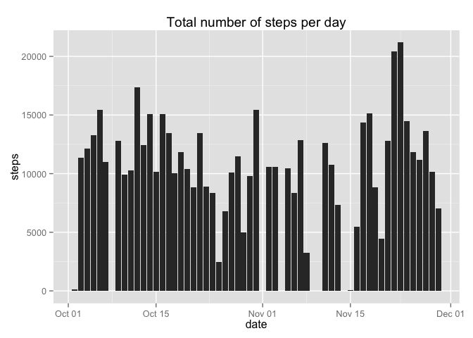
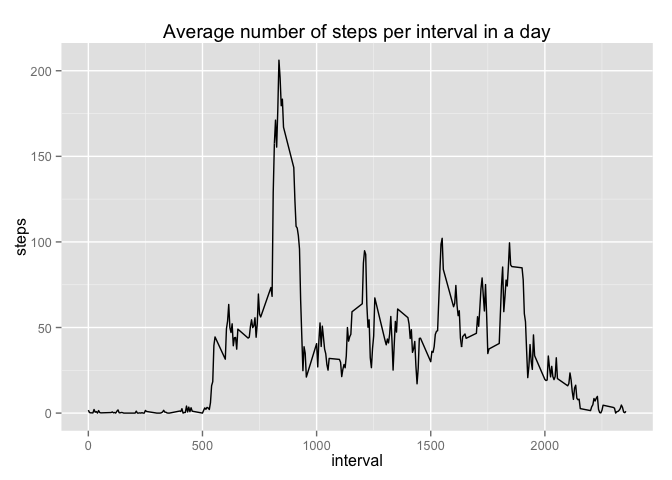
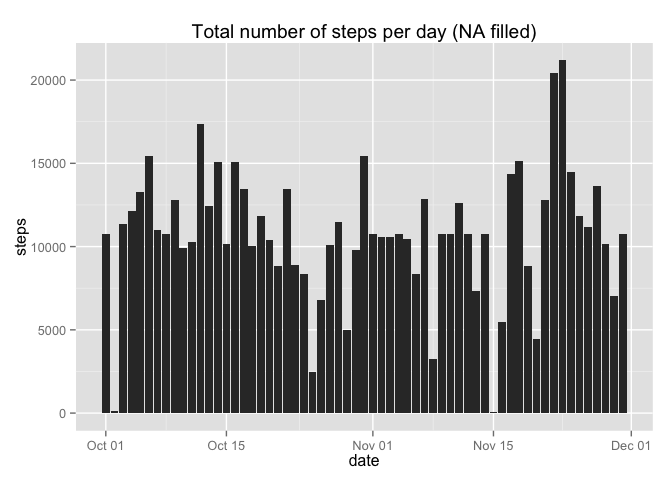
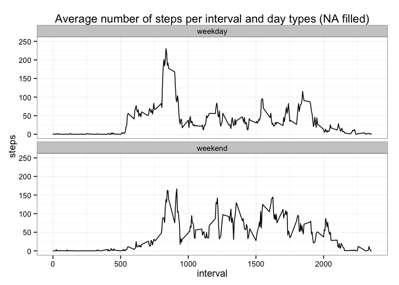

# Reproducible Research: Peer Assessment 1
Florian Eiden  
14 janvier 2015  


## Loading and preprocessing the data
0. Load required package(s) and alter global setting(s)

```r
library(ggplot2)
library(lattice)
Sys.setlocale("LC_TIME", "en_US")
```

```
## [1] "en_US"
```

1. Load the data

```r
#Unzip and load the file
setwd("~/Documents/GitHub/RepData_PeerAssessment1")
unzip("activity.zip")
activity <- read.csv("activity.csv",header=TRUE, sep=",")
```


2. Process/Transform the data

```r
#Convert the date in a date format
activity$date <- as.Date(activity$date)
#Check that everything looks good
summary(activity)
```

```
##      steps             date               interval     
##  Min.   :  0.00   Min.   :2012-10-01   Min.   :   0.0  
##  1st Qu.:  0.00   1st Qu.:2012-10-16   1st Qu.: 588.8  
##  Median :  0.00   Median :2012-10-31   Median :1177.5  
##  Mean   : 37.38   Mean   :2012-10-31   Mean   :1177.5  
##  3rd Qu.: 12.00   3rd Qu.:2012-11-15   3rd Qu.:1766.2  
##  Max.   :806.00   Max.   :2012-11-30   Max.   :2355.0  
##  NA's   :2304
```

```r
head(activity,5)
```

```
##   steps       date interval
## 1    NA 2012-10-01        0
## 2    NA 2012-10-01        5
## 3    NA 2012-10-01       10
## 4    NA 2012-10-01       15
## 5    NA 2012-10-01       20
```

## What is mean total number of steps taken per day?
We ignore the missing values in the dataset

```r
#Filter the NA rows
activity_full <- subset(activity, steps != 'NA')
```

1. Histogram of the total number of steps taken each day

```r
# Aggregate to sum the number of steps per day
h1 <- aggregate(activity_full$steps, by=list(activity_full$date), FUN = sum)
names(h1) <- c("date","steps") 

# Display the plot (Data, Barplot, Title)
q1 <- ggplot(h1,aes(x=date, y=steps))
q1 <- q1 + geom_bar(stat="identity")
q1 <- q1 + ggtitle("Total number of steps per day")
q1
```

 

2. Mean and median total number of steps taken per day

```r
activity_full_mean <- mean(h1$steps)
activity_full_mean
```

```
## [1] 10766.19
```

```r
activity_full_median <- median(h1$steps)
activity_full_median
```

```
## [1] 10765
```


## What is the average daily activity pattern?
1. Make a time series plot (i.e. `type = "l"`) of the 5-minute interval (x-axis) and the average number of steps taken, averaged across all days (y-axis)

```r
# Aggregate to average the number of steps per interval
h2 <- aggregate(activity_full$steps, by=list(activity_full$interval), FUN = mean)
names(h2) <- c("interval","steps") 

# Display the plot (Data, Line plot, Title)
q2 <- ggplot(h2,aes(x=interval, y=steps))
q2 <- q2 + geom_line()
q2 <- q2 + ggtitle("Average number of steps per interval in a day")
q2
```

 


2. Which 5-minute interval, on average across all the days in the dataset, contains the maximum number of steps?

```r
# Display the interval containing the maximum number of steps on average
subset(h2,h2$steps==max(h2$steps))
```

```
##     interval    steps
## 104      835 206.1698
```

## Imputing missing values

Note that there are a number of days/intervals where there are missing values (coded as `NA`
). The presence of missing days may introduce bias into some calculations or summaries of the data.

1. Calculate and report the total number of missing values in the dataset (i.e. the total number of rows with `NA`s)

```r
# Count the NA in steps
sum(
  is.na(activity$steps)
    )
```

```
## [1] 2304
```

2. Devise a strategy for filling in all of the missing values in the dataset. The strategy does not need to be sophisticated. For example, you could use the mean/median for that day, or the mean for that 5-minute interval, etc.

```r
# Create a set to play with
activity_corrected <- activity
# Join with the average per interval set on intervals, correct names
activity_corrected <- merge(activity_corrected,h2, by = "interval", all.x=TRUE)
names(activity_corrected) <- c("interval","steps","date","avg_steps")

# Replace the steps value by the average when it's NA (note the cast in int+round to respect the data format)
activity_corrected$steps[is.na(activity_corrected$steps)] <- as.integer(round(activity_corrected$avg_steps[is.na(activity_corrected$steps)],0))
```

3. Create a new dataset that is equal to the original dataset but with the missing data filled in.

```r
# New dataset equal to the original one
activity_filled <- activity_corrected[,c(2,3,1)]
```

4. Make a histogram of the total number of steps taken each day and Calculate and report the mean and median total number of steps taken per day. Do these values differ from the estimates from the first part of the assignment? What is the impact of imputing missing data on the estimates of the total daily number of steps?

```r
# Same code as first part
# Aggregate to sum the number of steps per day
h1_filled <- aggregate(activity_filled$steps, by=list(activity_filled$date), FUN = sum)
names(h1_filled) <- c("date","steps") 

# Display the plot (Data, Barplot, Title)
q1_filled <- ggplot(h1_filled,aes(x=date, y=steps))
q1_filled <- q1_filled + geom_bar(stat="identity")
q1_filled <- q1_filled + ggtitle("Total number of steps per day (NA filled)")
q1_filled
```

 

```r
# Calculate the mean and median
activity_filled_mean <- mean(h1_filled$steps)
activity_filled_mean
```

```
## [1] 10765.64
```

```r
activity_filled_median <- median(h1_filled$steps)
activity_filled_median
```

```
## [1] 10762
```

```r
# Difference between full (without NA values) and filled (with average values per interval instead of NA values)
activity_filled_mean - activity_full_mean
```

```
## [1] -0.549335
```

```r
activity_filled_median - activity_full_median
```

```
## [1] -3
```

*If we reintroduce mean values in the data set, the average and mean decrease while the total increases.
That's expected as we restore the missing days in the calculations.*

## Are there differences in activity patterns between weekdays and weekends?

For this part the `weekdays()` function may be of some help here. Use the dataset with the filled-in missing values for this part.

1. Create a new factor variable in the dataset with two levels – “weekday” and “weekend” indicating whether a given date is a weekday or weekend day.

```r
activity_filled$daytype[   weekdays(activity_filled$date) %in% c("Saturday","Sunday") ] <- "weekend" 
activity_filled$daytype[ ! weekdays(activity_filled$date) %in% c("Saturday","Sunday") ] <- "weekday"
activity_filled$daytype <- as.factor(activity_filled$daytype)
```

2. Make a panel plot containing a time series plot (i.e. `type = "l"`) of the 5-minute interval (x-axis) and the average number of steps taken, averaged across all weekday days or weekend days (y-axis). See the README file in the GitHub repository to see an example of what this plot should look like using simulated data.

```r
# Aggregate to average the number of steps per interval and day type
h3 <- aggregate(activity_filled$steps, by=list(activity_filled$interval,activity_filled$daytype), FUN = mean)
names(h3) <- c("interval","daytype","steps") 

# Display the plot (Data, Line plot, facet on 2 rows, title)
q3 <- ggplot(h3,aes(x=interval, y=steps))
q3 <- q3 + facet_wrap(~daytype, ncol = 1, scales = "free_y") + theme_bw() + ylim(0,250)
q3 <- q3 + geom_line()
q3 <- q3 + ggtitle("Average number of steps per interval and day types (NA filled)")
q3
```

 

End of file!
